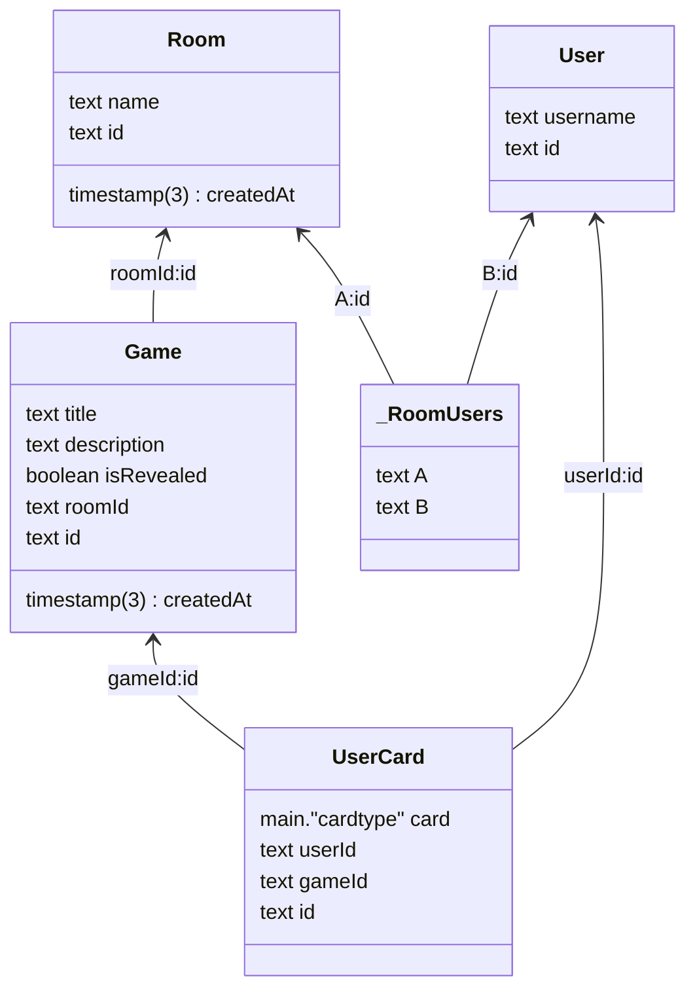

# Poker Planning

> work in progress

## Database Diagram

```mermaid
classDiagram
direction BT
class Game {
   text title
   text description
   timestamp(3) createdAt
   boolean isRevealed
   text roomId
   text id
}
class Room {
   text name
   timestamp(3) createdAt
   text id
}
class User {
   text username
   text id
}
class UserCard {
   main."cardtype" card
   text userId
   text gameId
   text id
}
class _RoomUsers {
   text A
   text B
}

Game --> Room : roomId#colon;id
UserCard --> Game : gameId#colon;id
UserCard --> User : userId#colon;id
_RoomUsers --> Room : A#colon;id
_RoomUsers --> User : B#colon;id
```