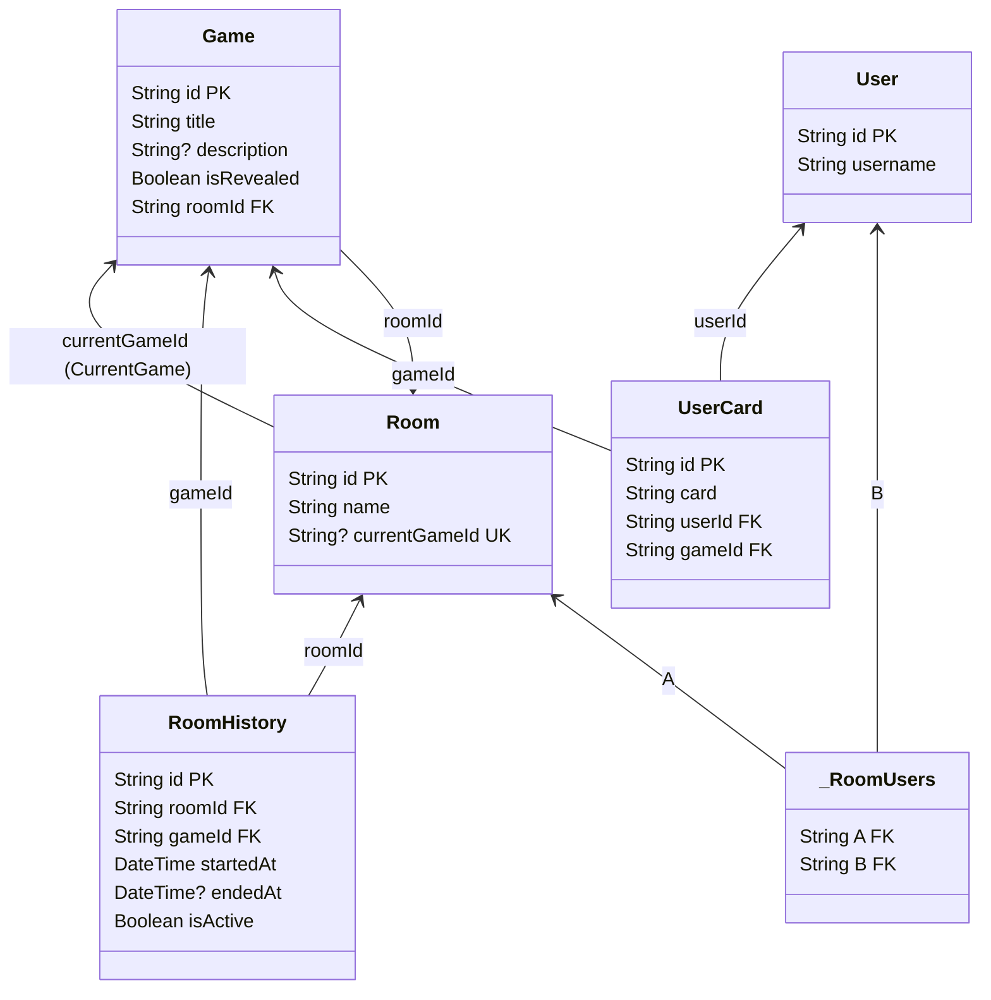

# Poker Planning ♠️


Russian translation of this file is available: [Русская версия 🇷🇺](README.ru.md)

## Features ✨

- Real-time collaborative planning poker sessions
- Voice control integration with Salute Assistant 🎙️
- Support for up to 10 players per room 👥
- Multiple estimation rounds 🔄
- Easy room sharing with readable IDs 🔗

## Salute Voice Assistant Integration 🤖

This app includes integration with Salute (SberBank's voice assistant platform) for hands-free poker planning sessions.

### Supported Voice Commands 🗣️

- **Choose Card**: "Выбери карту 5" / "Поставь карту 8" / "Возьми карту 13"
  - Only works when cards are not revealed
  - Automatically selects the specified card value
- **Start New Round**: "Начни новый раунд" / "Следующий раунд" / "Начать сначала"
  - Only works when all players have voted and cards are revealed
  - Starts a fresh voting round

### Voice Assistant Features 💡

- **Smart Context Awareness**: Commands only work when appropriate (e.g., can't select cards when they're revealed)
- **Real-time State Sync**: Assistant state updates automatically with room changes
- **Visual Indicators**: Shows when voice assistant is active and available commands
- **Bilingual Support**: Works with both Russian and English interfaces

### Setup ⚙️

1. Get your Salute token from [Salute Studio](https://developers.sber.ru/portal/products/smartapp-code)
2. Add it to your environment variables:
   ```bash
   NEXT_PUBLIC_SALUTE_TOKEN="your_salute_token_here"
   NEXT_PUBLIC_SALUTE_SMARTAPP="your_smartapp_name_here"
The assistant will automatically initialize when you join a room

Development 🔧
In development mode, the app uses createSmartappDebugger for testing voice commands. In production, it uses the standard createAssistant.

Database Diagram 📊

