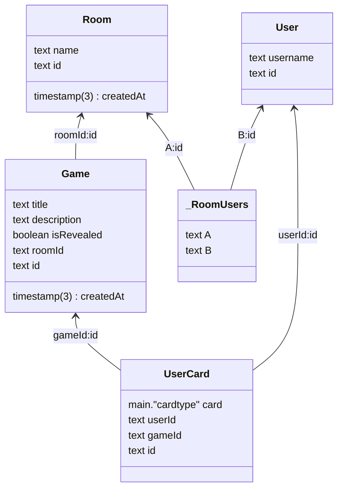

# Poker Planning

> work in progress

## Features

- Real-time collaborative planning poker sessions
- Voice control integration with Salute Assistant
- Support for up to 10 players per room
- Multiple estimation rounds
- Easy room sharing with readable IDs

## Salute Voice Assistant Integration

This app includes integration with Salute (SberBank's voice assistant platform) for hands-free poker planning sessions.

### Supported Voice Commands

- **Choose Card**: "Выбери карту 5" / "Поставь карту 8" / "Возьми карту 13"
- **Start New Round**: "Начни новый раунд" / "Следующий раунд" / "Начать сначала"

### Setup

1. Get your Salute token from [Salute Studio](https://developers.sber.ru/portal/products/smartapp-code)
2. Add it to your environment variables:
   ```bash
   NEXT_PUBLIC_SALUTE_TOKEN="your_salute_token_here"
   ```
3. The assistant will automatically initialize when you join a room

### Development

In development mode, the app uses `createSmartappDebugger` for testing voice commands. In production, it uses the standard `createAssistant`.

## Database Diagram


