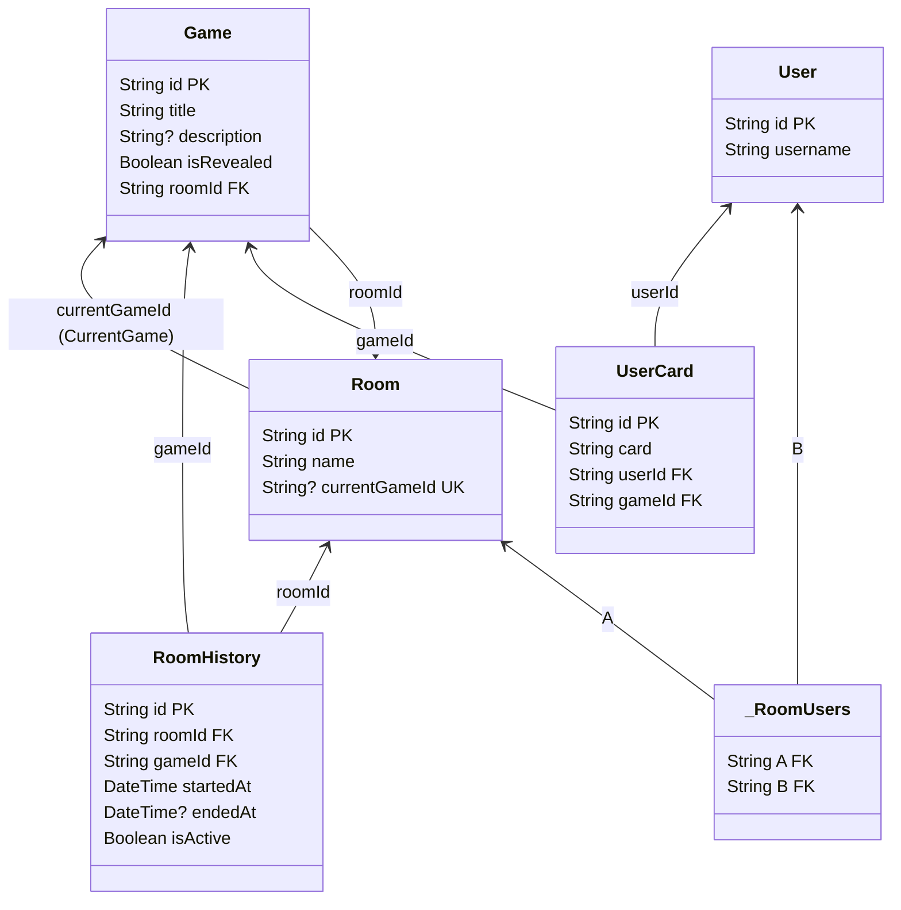

# Покер планирование ♠️


## Возможности ✨

- Совместные сессии планирования в реальном времени
- Интеграция с голосовым ассистентом Салют 🎙️
- Поддержка до 10 участников в комнате 👥
- Несколько раундов оценки 🔄
- Простой обмен ссылками на комнату с читаемыми ID 🔗

## Интеграция с голосовым ассистентом Салют 🤖

Приложение включает интеграцию с платформой голосового ассистента Салют (от СберБанка) для проведения сессий планирования без использования рук.

### Поддерживаемые голосовые команды 🗣️

- **Выбор карты**: "Выбери карту 5" / "Поставь карту 8" / "Возьми карту 13"
  - Работает только когда карты не открыты
  - Автоматически выбирает указанное значение карты
- **Новый раунд**: "Начни новый раунд" / "Следующий раунд" / "Начать сначала"
  - Работает только когда все участники проголосовали и карты открыты
  - Начинает новый раунд голосования

### Особенности голосового ассистента 💡

- **Контекстное понимание**: Команды работают только в подходящий момент
- **Синхронизация состояния**: Состояние ассистента обновляется автоматически при изменениях в комнате
- **Визуальные индикаторы**: Показывает активность ассистента и доступные команды
- **Поддержка двух языков**: Работает с русским и английским интерфейсом

### Настройка ⚙️

1. Получите токен Salute в [Salute Studio](https://developers.sber.ru/portal/products/smartapp-code)
2. Добавьте его в переменные окружения:
   ```bash
   NEXT_PUBLIC_SALUTE_TOKEN="ваш_токен"
   NEXT_PUBLIC_SALUTE_SMARTAPP="название_вашего_приложения"
3. Ассистент автоматически активируется при входе в комнату

### Разработка 🔧
В режиме разработки приложение использует createSmartappDebugger для тестирования голосовых команд. В продакшене используется стандартный createAssistant.

### Диаграмма базы данных 📊

